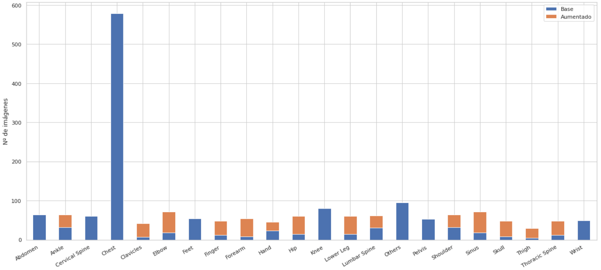
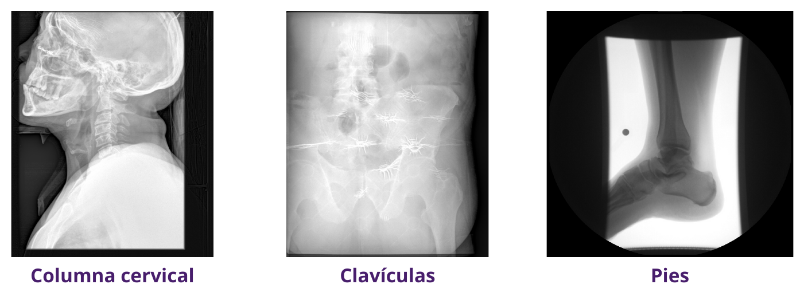

# Data Project 4: X-ray iamge classification

Project based on this [Kaggle competition](https://www.kaggle.com/competitions/edemdataproject4/overview) where all details can be found.

# Strategies
## Models
- DenseNet169
- DenseNet201 (model with the best performance)

## Data augmentaion
The following transformations are randomly applied to the train set. Each iteration duplicates the amount of images from the applied category.
- Rotation (custom for each category)
- Translation ±5% and crop
- Brightness ±10%
- Gaussian blur ±10%
- Salt and peeper noise
- Zoom ±15%
- Horizontal flip
**Note**: all of these transformations are executed by EDEM\_DP4\_X\_RAY.ipynb

### First iteration
- Multiplicated by 4: categories 4, 8, 18 and 19.
- Multiplicated by 2: categories 5, 7, 10, 12, 17 and 20.

### Second iterations
- Multiplicated by 2: categories 1, 4, 5, 7, 8, 9, 10, 12, 13, 16, 17, 18, 19 and 20.

### Category distribution before and after data augmentaion
After applying data augmentation, a more balanced dataset is obtained.

## Image removal
Removed from train set some misclassified or ambiguous images.

- 1.2.826.0.1.3680043.8.498.18756375772921861102889244085767353729
- 1.2.826.0.1.3680043.8.498.53157649924643943909744973791621454199
- 1.2.826.0.1.3680043.8.498.72672335045912268921999325675131058921

# Results
## Data parameters
- Batch size = 8
- Size = 256x256 px
- 10% of validation data

## Model and train parameters
- DenseNet201
- Learning rate = 2.69e-03
- 62 epochs
- Train without unfreeze

## Evolution of scores
### 0.84756
- ResNet50
- Batch size = 16
- Size 128x128 px

### 0.90243
- Densenet201
- Batch size = 32
- Size 128x128 px

### 0.90548
- Densenet201 or Resnet101 (only frozen layers training)
- Batch size = 32
- Size 256x256 px
- Training with frozen and unfrozen layers training

### 0.91768
- DenseNet169
- Batch size = 32
- Size 256x256 px
- Horizontal flip, rotation, salt and peeper and gaussian blur applied

### 0.92073
- Densenet201
- Batch size = 8
- Size 256x256 px
- Train with frozen layers

### 0.92682
- DenseNet169
- Batch size = 32
- Size 256x256 px7
- Frozen layers: 15 epochs
- Unfrozen layers: 7 epochs
- More data augmentation

### 0.93597
- Densenet201
- Batch size = 8
- Size 256x256 px
- Frozen layers: 18 epochs
- With the previous transformations and adding random zoom and custom rotation

### 0.93902
- Densenet201
- Batch size = 8
- Size 256x256 px
- Frozen layers: 18 epochs
- Unfrozen layers: 1 epoch
- With the previous transformations and adding random zoom and custom rotation

### 0.94512
- Densenet201
- Batch size = 8
- Size 256x256 px
- Frozen layers: 21 epochs
- Without the discarded images

### 0.94817
- Densenet201
- Batch size = 8
- Size 256x256 px
- Frozen layers: 61 epochs
- Random brightness and changed train/validation sizes

### 0.95121
- Densenet201
- Batch size = 8
- Size 256x256 px
- Frozen layers: 62 epochs
- Added random translation and crop

# About
A data project from Master's in Data Analytics (EDEM)
- Lluna Sanz Montrull
- Sergi Joan Sastre Antequera
